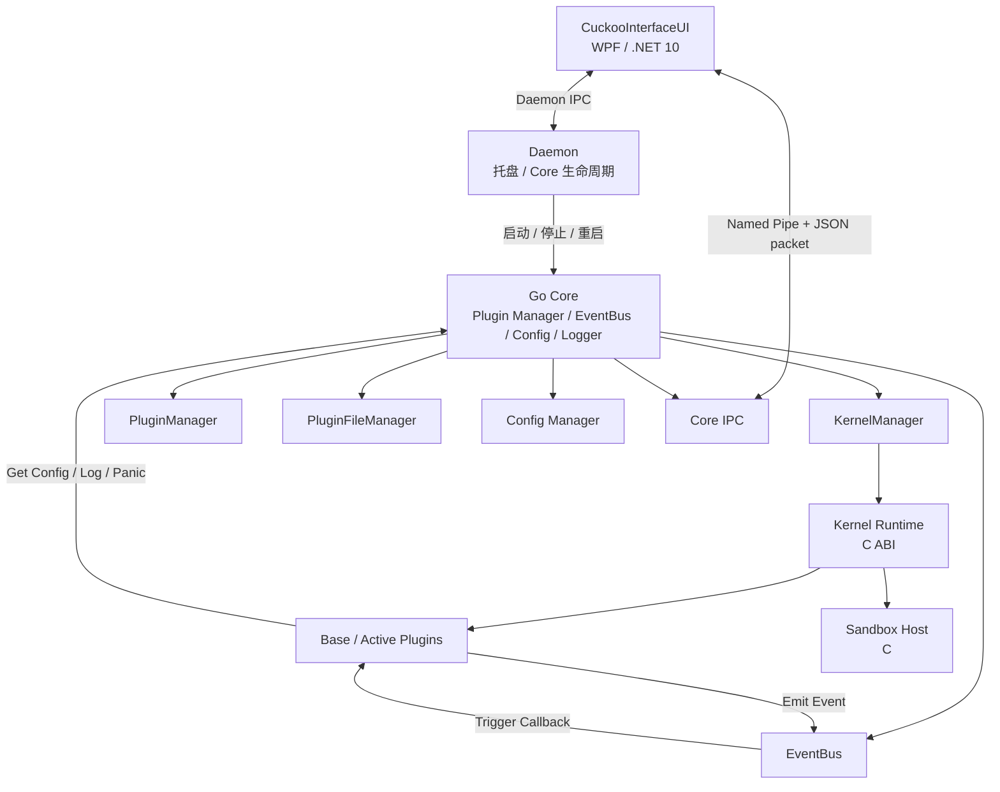

# CuckooInterface

<div align="center">
  
</div>

> 面向电教场景的**下一代插件平台**

CuckooInterface 是一个主要为电教场景打造的，面向 Windows 的插件运行时与宿主管理平台。

---

## 它为了解决什么?
我们观察到，当前电教场景经常存在小工具泛滥、难以管理的现状。即使ClassIsland提供了完善的自动化，但是它的能力受限于CI自动化框架的能力。

如果希望系统级集成，那么它也无法运行。因为ClassIsland的插件开发依赖C#，而C#具备一定的上手难度和门槛。

我们希望能解决这项问题，因此编写了CuckooInterface。

官方提供Python Kernel，只需要安装python就可以使用Python进行插件开发。

请阅读[PythonSDK](./implement/Kernel/PythonKernel/sdk/cuckoo_sdk/sdk.md)

---

## ✨ 特性

- **多层级插件模型**：Kernel / Base / Active
- **Kernel Runtime 抽象**：通过统一 C ABI 托管不同脚本/运行时
- **CGo + C ABI 桥接**：Go Core 与 Kernel / 插件运行时之间通过 Host API 交互
- **事件驱动架构**：内置 EventBus，支持事件提供、监听、异步分发与最近事件缓冲
- **插件热管理**：扫描、解压、加载、卸载、删除、外部安装
- **配置系统**：支持插件独立配置，并提供类型化 Setting / 动态 UI 描述模型
- **双 IPC 通道**：Core 与 Daemon 分别通过 Windows Named Pipe 对外提供控制接口
- **Daemon 守护**：负责 Core 生命周期、保活与系统托盘
- **WPF UI**：提供概览、插件、事件、日志、配置和设置等管理页面
- **可观测性**：日志、事件记录、插件状态、Kernel 状态与运行时信息均可通过 UI 查询
- **运行时隔离准备**：Kernel 通过 sandbox host 管理 DLL、线程、任务以及崩溃状态

---

## 🏗️ 架构概览



### 运行时关系

```text
                        ┌───────────────────────┐
                        │  CuckooInterfaceUI    │
                        │   WPF Desktop App     │
                        └──────────┬────────────┘
                                   │
                        Core Named Pipe / Daemon Pipe
                                   │
             ┌─────────────────────┴──────────────────────┐
             │                                            │
   ┌─────────▼─────────┐                        ┌─────────▼─────────┐
   │     Daemon        │                        │      Go Core      │
   │ Tray / KeepAlive  │                        │ Plugin Runtime    │
   └─────────┬─────────┘                        └───────┬───────────┘
             │                                          │
             │                              ┌───────────┼───────────┐
             │                              │           │           │
             │                         EventBus     Config      PluginMgr
             │                              │                       │
             │                              │                   KernelMgr
             │                              │                       │
             │                              │                 ┌─────▼─────┐
             │                              └───────────────► │  Kernel   │
             │                                                │ Runtime   │
             │                                                └─────┬─────┘
             │                                                      │
             │                                                Sandbox Host
             │                                                      │
             │                                                 DLL / Runtime
             └────────────────── Core Process ───────────────────────┘
```

---

## 🧩 插件分层

CuckooInterface 当前定义了三种插件类型：

| 类型 | 职责 | 典型能力 |
|---|---|---|
| `Kernel` | 提供底层运行时 | Lua / Python / 其他可被宿主统一托管的 runtime |
| `Base` | 基础能力插件、事件提供者 | 设备监控、进程监控、平台基础服务 |
| `Active` | 应用层插件、事件消费者 | 业务逻辑、自动化动作、事件响应 |

### Kernel

Kernel 是整个插件体系的运行时基础。

Kernel 通过 `CuckooKernelInterface` 对外提供：

- `init_runtime`
- `run_loop`
- `load_plugin`
- `trigger_callback`
- `unload_plugin`
- `shutdown_runtime`

并导出：

```c
__declspec(dllexport)
CuckooKernelInterface* get_cuckoo_kernel_interface(void);
```

Kernel 初始化时，宿主注入 `CuckooHostAPI`，Kernel 因而可以访问：

- `emit_event`
- `log_info`
- `log_error`
- `get_plugin_config`
- `into_loop_report`
- `panic`

### Base

Base 插件主要承担“提供平台能力”和“发布事件”的职责。

加载后，其 `provided_events` 会被注册到 EventBus。事件名需要全局唯一。

### Active

Active 插件主要承担“消费事件”和“执行业务逻辑”的职责。

其 `listeners` 会注册到 EventBus。当对应事件触发时，宿主将通过关联 Kernel 调用插件回调。

---

## 🔄 插件生命周期

插件文件管理与插件运行时管理是分离的。

```text
用户插件目录
    │
    ├─ 扫描
    │
    ├─ ZIP 解压
    │
    ├─ 读取 META-INF.json
    │
    ├─ Kernel 优先加载
    │      │
    │      └─ init_runtime()
    │
    ├─ Base / Active 加载
    │      │
    │      └─ Kernel.load_plugin()
    │
    ├─ 注册事件 / 监听器
    │
    └─ 进入运行态
```

卸载流程则会先清理 EventBus 中的监听器/事件，再让对应 Kernel 销毁插件实例，避免 EventBus 保留失效的插件句柄。

---

## 📦 插件目录与文件格式

项目定义了以下主要目录：

```text
logs/                  # Core 日志
user/                  # 用户插件根目录
user/Kernel/           # Kernel 插件
user/Base/             # Base 插件
user/Active/           # Active 插件
plugins/               # 运行时解压后的插件目录
configs/               # 全局配置与插件配置
```

运行时插件目录会把用户目录中的插件包解压到程序目录下的 `plugins/`。

### Kernel 插件入口

Kernel 插件目录中约定：

```text
binary/export.dll
```

宿主通过该 DLL 的导出函数获取 `CuckooKernelInterface`。

### 元数据

插件需要包含：

```text
META-INF.json
```

定义的插件元数据字段包括：

```json
{
  "name": "Example Plugin",
  "id": "com.example.plugin",
  "version": "1.0.0",
  "description": "Example plugin",
  "runtime_type": "lua",
  "icon": "icon.png",
  "config_page": "config/index.html",
  "tag": ["example"]
}
```

其中常用字段含义：

| 字段 | 含义 |
|---|---|
| `name` | 插件显示名称 |
| `id` | 插件唯一 ID |
| `type` | 插件类型，由宿主内部枚举定义 |
| `version` | 插件版本 |
| `description` | 插件描述 |
| `runtime_type` | 该插件依赖的 Kernel Runtime 类型 |
| `icon` | 可选图标路径 |
| `config_page` | 可选配置页面相对路径 |
| `tag` | 可选标签 |

> `runtime_type` 是 Kernel 与业务插件之间的关键匹配条件：插件加载时，Core 会根据 `runtime_type` 寻找已经初始化且提供对应 runtime 的 Kernel。

## 📁 项目结构

```text
CuckooInterface/
├── main.go                      # 程序入口，根据 launch_type 分发到 Core 或 Daemon
├── main_loop.go                 # Core 主循环（Normal 模式）
├── daemon_loop.go               # Daemon 主循环（托盘 / Core 保活）
├── constant.go                  # 进程间通信端口常量
├── build.bat                    # 一键构建脚本（Go Core + WPF UI + PythonKernel）
├── go.mod / go.sum              # Go 模块依赖
├── icon.ico / icon.png / icon.svg
├── LICENSE.txt
├── readme.md
│
├── core/                        # Go Core 运行时
│   ├── config/                  # 全局与插件配置
│   │   ├── config.go            # 配置加载与持久化
│   │   ├── globalPage.go        # 全局配置页模型
│   │   └── settings_models.go   # 设置面板数据模型
│   ├── constant/                # 常量、插件类型、目录、IPC 名称
│   │   └── constant.go
│   ├── event/                   # EventBus 事件总线
│   │   └── event_framework.go
│   ├── ipc/                     # Core 与前端的 IPC 桥接
│   │   ├── core_fronted_bridge.go
│   │   ├── pkgs.go              # IPC 数据包定义
│   │   └── protocol.go          # 协议帧格式
│   ├── logger/                  # 日志系统
│   │   └── logger.go
│   ├── plugin_manager/          # 插件与 Kernel 管理
│   │   ├── kernel_manager.go    # Kernel 加载 / 初始化 / 生命周期
│   │   ├── plugin_file_manager.go  # 插件扫描 / 解压 / 文件管理
│   │   └── plugin_manager.go    # Base / Active 插件加载与事件注册
│   └── utils/                   # 通用工具
│       ├── buffer.go            # 字节缓冲
│       ├── json.go              # JSON 辅助
│       ├── msgbox.go            # 系统消息框
│       ├── path.go              # 路径处理
│       ├── process.go           # 进程管理
│       └── singleinstance.go    # 单实例锁
│
├── dameon/                      # Daemon 进程（托盘 / Core 保活）
│   ├── daemon_fronted_bridge.go # Daemon 与前端 IPC
│   ├── dameon_utils.go
│   ├── get_args.go              # 启动参数解析
│   ├── system.go                # 系统调用
│   ├── tray.go                  # 系统托盘
│   └── icon.ico
│
├── plugins/                     # Kernel / Plugin C ABI 与 Go 桥接
│   ├── cuckoo_kernel.h          # Kernel 接口 ABI
│   ├── cuckoo_plugin.h          # Plugin Descriptor ABI
│   ├── kernel_warpper.go        # Go ↔ C Kernel 桥接（cgo）
│   ├── sandbox_host.c           # Kernel 沙箱宿主（DLL / 线程 / 崩溃隔离）
│   └── sandbox_host.h
│
├── implement/                   # Kernel 参考实现
│   └── Kernel/
│       ├── MockKernel/          # 最小化 Mock 内核（验证插件加载与事件链路）
│       │   ├── mock_kernel.h / mock_kernel.cpp
│       │   ├── json_utils.h
│       │   ├── CMakeLists.txt
│       │   ├── build.bat
│       │   ├── META-INF.json
│       │   └── sample_plugin/   # Mock 示例插件
│       │       ├── MockBaseDemo/
│       │       └── MockActiveDemo/
│       │
│       └── PythonKernel/        # CPython 运行时内核
│           ├── python_kernel.h / python_kernel.cpp
│           ├── json_utils.h
│           ├── CMakeLists.txt
│           ├── build.bat
│           ├── META-INF.json
│           ├── sdk/             # Python 插件开发 SDK
│           │   ├── install.bat  # SDK 安装脚本（一键装到 site-packages）
│           │   └── cuckoo_sdk/
│           │       ├── __init__.py
│           │       └── sdk.md   # SDK 文档
│           └── sample_plugin/   # Python 示例插件
│               ├── PythonBaseDemo/
│               └── PythonActiveDemo/
│
└── CuckooInterfaceUI/           # WPF 桌面前端
    ├── App.xaml / App.xaml.cs
    ├── MainWindow.xaml / MainWindow.xaml.cs
    ├── CuckooInterfaceUI.csproj
    ├── CuckooInterfaceUI.slnx
    ├── AssemblyInfo.cs
    ├── Models/                  # 前端数据模型
    │   ├── EventRecord.cs
    │   ├── LogEntry.cs
    │   ├── PluginInfo.cs
    │   ├── SettingsPanel.cs
    │   └── SystemOverview.cs
    ├── Pages/                   # 功能页面
    │   ├── HomePage.xaml        # 概览
    │   ├── PluginsPage.xaml     # 插件管理
    │   ├── ConfigPage.xaml      # 配置
    │   ├── EventsPage.xaml      # 事件记录
    │   ├── LogsPage.xaml        # 日志
    │   └── SettingsPage.xaml    # 设置
    ├── Services/
    │   └── CoreBackend.cs       # 与 Core / Daemon IPC 通信
    ├── Behaviors/
    │   └── SmoothScrollBehavior.cs
    └── Converters/
        └── VerticalTextConverter.cs
```

---

## 🔨 构建

当前项目包含 Go Core、C/CGO 桥接代码以及 .NET WPF UI，因此构建环境应为 Windows 开发环境。

### 一键构建（推荐）

根目录提供 `build.bat`，自动完成 Go Core、WPF UI 与 PythonKernel 的构建与打包：

```bat
build.bat
```

前置依赖：`go`、`dotnet`、`cmake`、`python` 均在 PATH 中。

产物输出到 `bin/` 目录，包含 `CuckooInterface.exe`、WPF UI 文件以及 `user/Kernel/PythonKernel.zip`。

### 构建 Go Core

```bash
go build -ldflags="-H windowsgui" .
```

由于项目使用 CGO 与 C 桥接，构建环境需要具备可用的 CGO/C 编译链。

### 构建 UI

项目 UI 使用：

```text
.NET 10
WPF
WPF-UI 3.0.5
```

构建：

```bash
dotnet build CuckooInterfaceUI/CuckooInterfaceUI.csproj
```

### 构建 PythonKernel

```bat
cd implement\Kernel\PythonKernel
build.bat
```

产物为 `build\Release\export.dll`，需与 `META-INF.json`、`sdk/` 目录一同打包为 `PythonKernel.zip`，放入 `user/Kernel/` 目录。

---

## ▶️ 启动方式

程序入口根据 `launch_type` 决定启动模式。

### Normal

```bash
CuckooInterface.exe -launch_type normal
```

Normal 模式直接运行 Core。

### Daemon

```bash
CuckooInterface.exe -launch_type dameon
```

或者不传参数时进入 Daemon 模式。

Daemon 模式负责：

1. 启动 Daemon
2. 建立 Daemon IPC
3. 启动 Core
4. 启动 UI
5. 维持 Core
6. 退出时统一清理


## 🧪 一个插件应该如何工作

一个典型的 Base / Active 插件可以抽象成：

```text
1. 被添加，并放入 user/Base 或 user/Active
2. Core 扫描并解压
3. Core 读取 META-INF.json
4. 根据 runtime_type 找到匹配 Kernel
5. Kernel 创建插件实例
6. Base -> 注册 provided events
7. Active -> 注册 listeners
8. 运行时通过 EventBus 传递事件
9. 插件通过 HostAPI 获取配置、记录日志或发送事件
10. 卸载时反注册事件并销毁插件实例
```

---
